# GitHub Readme Stats Fast Action

Generate [GitHub Readme Stats Fast](https://github.com/pranesh-2005/github-readme-stats-fast) cards in your GitHub Actions workflow, commit them to your profile repository, and embed them directly from there.

## Quick start

```yaml
name: Update README cards

on:
  schedule:
    - cron: "0 0 * * *"
  workflow_dispatch:

permissions:
  contents: write

jobs:
  build:
    runs-on: ubuntu-latest
    steps:
      - uses: actions/checkout@v4

      - name: Generate stats card
        uses: Pranesh-2005/github-readme-stats-fast-action@v1
        with:
          card: stats
          options: username=${{ github.repository_owner }}&show_icons=true
          path: profile/stats.svg
          token: ${{ secrets.GITHUB_TOKEN }}

      - name: Generate top languages card
        uses: Pranesh-2005/github-readme-stats-fast-action@v1
        with:
          card: top-langs
          options: username=${{ github.repository_owner }}&layout=compact&langs_count=6
          path: profile/top-langs.svg
          token: ${{ secrets.GITHUB_TOKEN }}

      - name: Generate streak card
        uses: Pranesh-2005/github-readme-stats-fast-action@v1
        with:
          card: streak
          options: username=${{ github.repository_owner }}&layout=compact
          path: profile/streak.svg
          token: ${{ secrets.GITHUB_TOKEN }}

      - name: Generate pin card
        uses: Pranesh-2005/github-readme-stats-fast-action@v1
        with:
          card: pin
          options: username=pranesh-2005&repo=github-readme-stats-fast
          path: profile/pin-github-readme-stats-fast.svg
          token: ${{ secrets.GITHUB_TOKEN }}

      - name: Commit cards
        run: |
          git config user.name "github-actions"
          git config user.email "github-actions@users.noreply.github.com"
          git add profile/*.svg
          git commit -m "Update README cards" || echo "No changes to commit"
          git push origin HEAD
```

Then embed from your profile README:

```md




```

## Deployment options

This action is a recommended deployment option. You can also deploy on Vercel or other platforms. See the [GitHub Readme Stats Fast README](https://github.com/Pranesh-2005/github-readme-stats-fast#deploy-on-your-own).

## Inputs

- `card` (required): Card type. Supported: `stats`, `top-langs`, `streak`, `pin`, `wakatime`, `gist`.
- `options`: Card options as a query string (`key=value&...`) or JSON. If `username` is omitted, the action uses the repository owner.
- `path`: Output path for the SVG file. Defaults to `profile/<card>.svg`.
- `token`: GitHub token (PAT or `GITHUB_TOKEN`). For private repo stats, use a [PAT](https://docs.github.com/en/authentication/keeping-your-account-and-data-secure/managing-your-personal-access-tokens) with `repo` and `read:user` scopes.

## Examples

Stats example:

```yaml
with:
  card: stats
  options: username=octocat&show_icons=true&hide_rank=true&bg_color=0D1117
  token: ${{ secrets.GITHUB_TOKEN }}
```

Top languages example:

```yaml
with:
  card: top-langs
  options: username=octocat&layout=compact&langs_count=6
  token: ${{ secrets.GITHUB_TOKEN }}
```

Streak example:

```yaml
with:
  card: streak
  options: username=octocat&layout=compact
  token: ${{ secrets.GITHUB_TOKEN }}
```

WakaTime example:

```yaml
with:
  card: wakatime
  options: username=octocat&layout=compact
  token: ${{ secrets.GITHUB_TOKEN }}
```

Gist example:

```yaml
with:
  card: gist
  options: id=0123456789abcdef
  token: ${{ secrets.GITHUB_TOKEN }}
```

JSON options example:

```yaml
with:
  card: stats
  options: '{"username":"octocat","show_icons":true,"hide_rank":true}'
  token: ${{ secrets.GITHUB_TOKEN }}
```

## Notes

- This action uses the same renderers and fetchers as [Pranesh-2005/github-readme-stats-fast](https://github.com/pranesh-2005/github-readme-stats-fast).